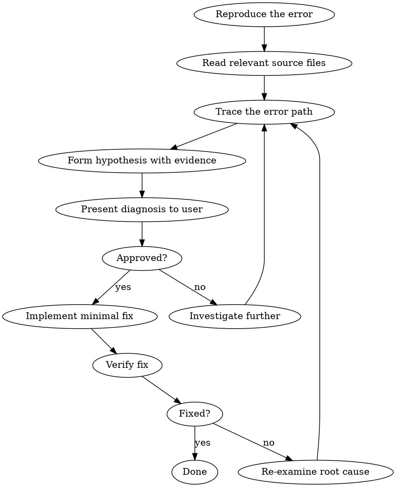

# Debug

Structured debugging that investigates before fixing. No guessing, no shotgun fixes.

## The Rule

**Do NOT edit code until you have a diagnosis approved by the user.**

## Workflow

### Step 1: Reproduce

- Run the failing command/test and capture full error output
- If no repro steps, ask the user

### Step 2: Investigate

- Read the source files involved in the error path
- Check logs, stack traces, error messages
- Trace data flow from input to failure point
- Check recent changes (`git diff`, `git log`) if relevant

### Step 3: Diagnose

Present to the user:
1. **Root cause** — what's actually wrong and why
2. **Evidence** — specific lines, logs, or data that support the diagnosis
3. **Proposed fix** — minimal change to resolve the issue

### Step 4: Fix & Verify

- Apply the smallest fix that resolves the root cause
- Run the failing test/command again to confirm
- Run the full test suite to check for regressions

## Red Flags — You're Guessing

- Editing code without reading the error path first
- Trying a fix "to see if it works"
- Changing multiple things at once
- Suggesting a fix within 30 seconds of seeing the error
- Modifying unrelated code "while you're in there"

**If you catch yourself doing any of these: STOP. Go back to step 2.**

## Rules

- One fix at a time — never batch multiple changes
- Simplest fix first — don't refactor to fix a bug
- If the first fix doesn't work, re-examine root cause — don't try variations
- Never modify test assertions to make tests pass
