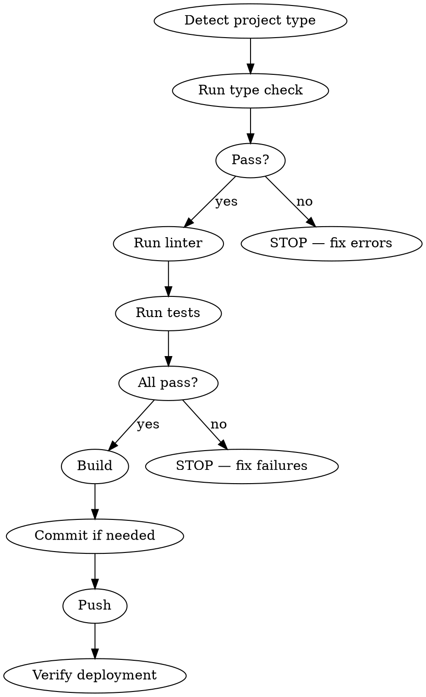

# Deploy

Pre-deploy validation checklist. Catches broken builds, type errors, and failing tests before they reach production.

## Workflow

### Step 1: Detect Project Type

| File | Stack | Type Check | Lint | Test | Build |
|------|-------|------------|------|------|-------|
| `tsconfig.json` | TypeScript | `pnpm run typecheck` or `npx tsc --noEmit` | `pnpm run lint` | `pnpm test` or `pnpm test:run` | `pnpm build` |
| `go.mod` | Go | `go vet ./...` | `golangci-lint run` (if available) | `go test ./...` | `go build ./...` |
| `*.csproj` / `*.sln` | C# | `dotnet build --no-restore` | — | `dotnet test` | `dotnet publish` |
| `package.json` (no TS) | JavaScript | — | `pnpm run lint` | `pnpm test` | `pnpm build` |

Always prefer project scripts from `package.json` or `Makefile` over raw commands.

### Step 2: Validate

Run checks sequentially. **Stop on first failure** — fix before continuing.

1. Type check / compile
2. Lint (if available)
3. Tests

### Step 3: Build & Push

1. Run production build
2. Check for uncommitted changes — commit if needed
3. Push to remote
4. Verify deployment succeeded (check CI, health endpoint, or deploy output)

## Rules

- **Never skip validation** — even for "small changes"
- **Never force push** without explicit user approval
- If any check fails, fix the issue and restart from step 2
- Report final deployment status with URL if available
